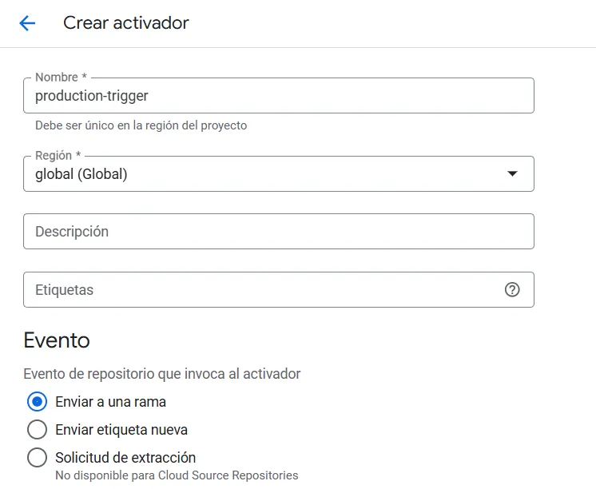
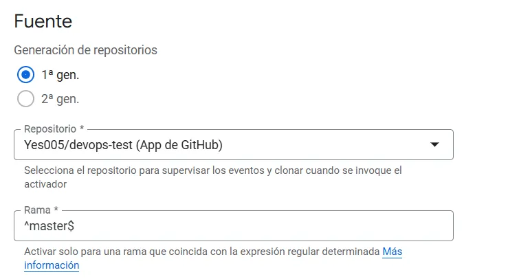
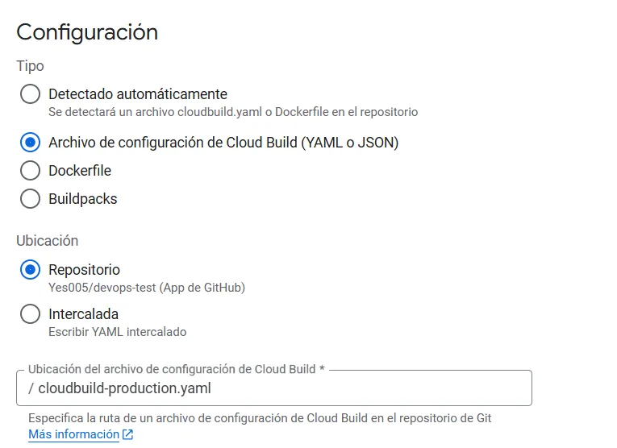
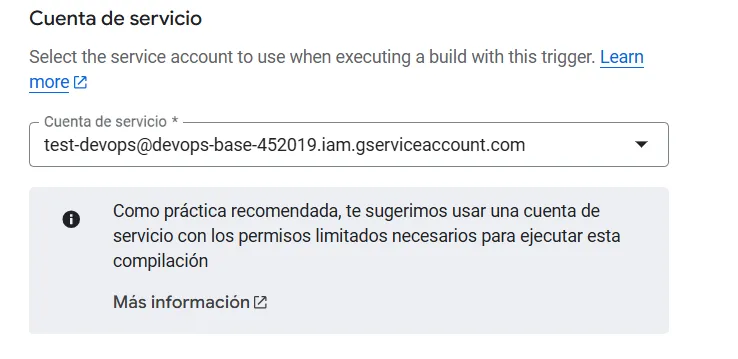
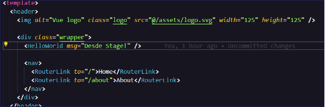
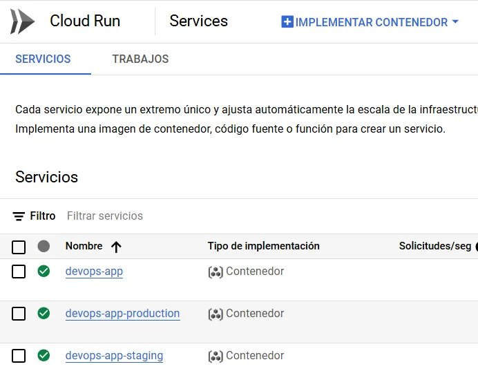
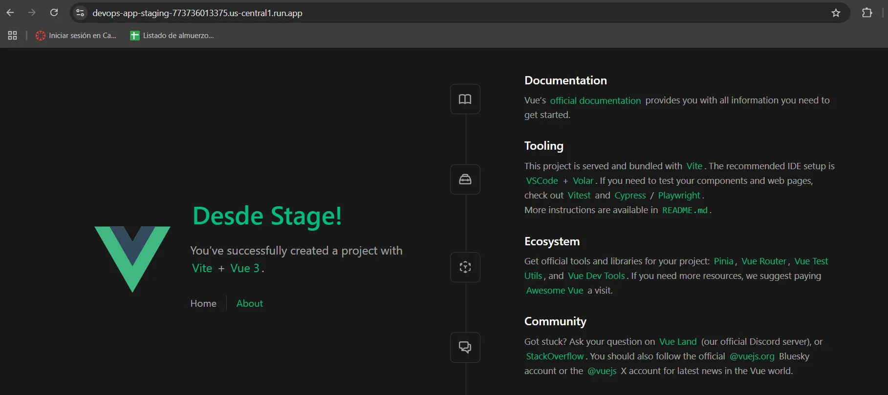

# [Manual] Despliegue automatizado con Vue.js 3, GitHub y GCP
## Visión general
En esta sección, vamos a desarrollar paso a paso un ejemplo completo que demuestra cómo implementar una metodología DevOps eficiente. Utilizaremos:

- Una aplicación frontend desarrollada en Vue.js 3.
- GitHub como sistema de control de versiones.
- Servicios de Google Cloud Platform orientados a DevOps para automatizar el despliegue.

>***Nota importante:** antes de comenzar, asegúrate de crear una cuenta de servicio en tu proyecto de GCP con los permisos mínimos necesarios para administrar los recursos que utilizaremos.*
## Preparación la aplicación y dockerización
1. Descargar el siguiente proyecto [**Archivos.zip**](https://drive.google.com/file/d/1FbsgCc_haIZZVzgmlPq9X0uNMS8ZBgGq), al descomprimir el `.zip` se encontrará dentro los archivos de un proyecto de prueba de Vue.js 3, llamado ***“devops-test”.***
1. ​Crear un repositorio en GitHub y subir a ese repositorio la app descargada.
1. Crear un archivo en la raíz de nuestro proyecto llamado **`Dockerfile`**. 
1. Agregar el siguiente código, que creará una imagen de nuestra aplicación y creará un servidor web con Nginx, con un archivo de configuración en la raíz de nuestro proyecto que lo expone en el puerto `8080`:
   ```Dockerfile
   FROM node:18 AS build

   WORKDIR /app

   COPY package.json  ./

   RUN npm install

   COPY . .

   RUN npm run build

   FROM nginx:stable-alpine

   COPY --from=build /app/dist /usr/share/nginx/html

   COPY nginx.conf /etc/nginx/nginx.conf

   EXPOSE 8080

   CMD ["nginx", "-g", "daemon off;"]
   ```
5. En Cloud Shell o desde el SDK de Google crear un repositorio para almacenar las imágenes Docker en GCP:
   ```bash
   gcloud artifacts repositories create devops-repository \
         --repository-format=docker \
         --location=us-central1 \
         --description="Repositorio de pruebas Devops"
   ```
6. Creamos la imagen localmente:
   ```bash
   docker build -t app-devops-image .
   ```
7. Ahora llevamos nuestra imagen hacia el repositorio en GCP:
   ```bash
   docker tag app-devops-image us-central1-docker.pkg.dev/$GOOGLE\_CLOUD\_PROJECT/devops-repository/app-devops-image


   docker push us-central1-docker.pkg.dev/$GOOGLE\_CLOUD\_PROJECT/devops-repository/app-devops-image

## Desplegando imagen
Tenemos la imagen de nuestra aplicación lista. Ahora vamos a levantarla en una instancia de Cloud Run:
```bash
gcloud run deploy devops-app \
      --image us-central1-docker.pkg.dev/$GOOGLE\_CLOUD\_PROJECT/devops-repository/app-devops-image \
      --region us-central1 \
      --platform managed \
      --allow-unauthenticated
```
## Despliegue automático
Crearemos 2 ambientes, uno de pruebas y uno de producción, con Cloud Build haremos que detecte los cambios de sus respectivas ramas para hacer un despliegue con los cambios en los diferentes ambientes:

1. Crear archivo en la raiz del proyecto llamado `cloudbuild-staging.yaml`.
1. Y pegar el siguiente código. `Ctrl + O` para guardar y `Ctrl + X` para salir:
   ```yaml
   steps:
   - name: 'gcr.io/cloud-builders/docker'
      args: [
         'build',
         '-t',
         'us-central1-docker.pkg.dev/$PROJECT_ID/devops-repository/app-devops-image:$COMMIT_SHA',
         '.'
      ]
   - name: 'gcr.io/cloud-builders/docker'
      args: [
         'push',
         'us-central1-docker.pkg.dev/$PROJECT_ID/devops-repository/app-devops-image:$COMMIT_SHA'
      ]
   - name: 'gcr.io/cloud-builders/gcloud'
      entrypoint: 'gcloud'
      args: [
         'run',
         'deploy',
         'devops-app-staging',
         '--image',
         'us-central1-docker.pkg.dev/$PROJECT_ID/devops-repository/app-devops-image:$COMMIT_SHA',
         '--region',
         'us-central1',
         '--platform',
         'managed',
         '--allow-unauthenticated'
      ]
   images:
   - 'us-central1-docker.pkg.dev/$PROJECT_ID/devops-repository/app-devops-image:$COMMIT_SHA'
   options:
   logging: CLOUD_LOGGING_ONLY
   ```
3. Crear un segundo archivo en la raíz del proyecto llamado `cloudbuild-production.yaml`: 
   ```yaml
   steps:
   - name: 'gcr.io/cloud-builders/docker'
      args: [
         'build',
         '-t',
         'us-central1-docker.pkg.dev/$PROJECT_ID/devops-repository/app-devops-image:$COMMIT_SHA',
         '.'
      ]
   - name: 'gcr.io/cloud-builders/docker'
      args: [
         'push',
         'us-central1-docker.pkg.dev/$PROJECT_ID/devops-repository/app-devops-image:$COMMIT_SHA'
      ]
   - name: 'gcr.io/cloud-builders/gcloud'
      entrypoint: 'gcloud'
      args: [
         'run',
         'deploy',
         'devops-app-production',
         '--image',
         'us-central1-docker.pkg.dev/$PROJECT_ID/devops-repository/app-devops-image:$COMMIT_SHA',
         '--region',
         'us-central1',
         '--platform',
         'managed',
         '--allow-unauthenticated'
      ]
   images:
   - 'us-central1-docker.pkg.dev/$PROJECT_ID/devops-repository/app-devops-image:$COMMIT_SHA'
   options:
   logging: CLOUD_LOGGING_ONLY
   ```
4. Nos dirigimos hacia Cloud Build (habilitamos la API de ser necesario).
1. En repositorios conectamos un nuevo repositorio (global, github, continuar, seleccionamos cuenta y el repositorio, aceptamos y creamos).
1. Pasamos a crear el trigger:

   

   
   
   
   
   

1. Seleccionamos la cuenta de servicio creada previamente y le damos crear.
1. Creamos una rama a partir de master con el nombre staging:
   ```bash
   git checkout -b staging
   ```
9. Creamos un segundo trigger con el nombre staging-trigger indicándole que use el archivo cloudbuild-staging.yaml y detecte los cambios de la rama staging.

   

1. Buscamos el archivo App.vue y modificamos el mensaje del componente `HelloWorld`:
1. Incluímos los cambios a la rama staging:
   ```bash
   git add .

   git commit -m "Realizando cambios desde staging"

   git push origin staging
   ```
1. Nos crea la nueva instancia en Cloud Run para staging:

   

1. Entramos a la URL que nos genera y veremos nuestra app ya funcionando:

   