---
sidebar_position: 1
---

# Playbook DevOps
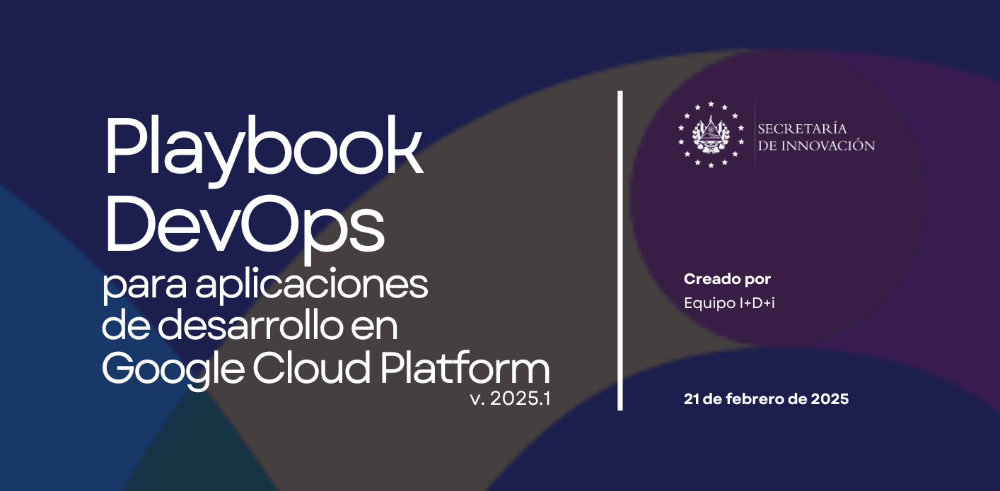
# Descargar Playbook en formato PDF

[Descargar Playbook](../../../static/docs/Playbook%20de%20DevOps%20-%20SIP.pdf)

# Introducción
En el contexto actual de transformación digital, la optimización de procesos y recursos tecnológicos constituye un imperativo estratégico para las orga-nizaciones. 

La adopción de arquitecturas cloud-native y metodologías ágiles demanda un enfoque sistemático que permita maximizar el potencial de las plataformas de computación en la nube.

El equipo de Investigación, Desarrollo e innovación (I-D-i) de la Secretaría de Innovación de la Presidencia ha realizado un análisis de las prácticas y herramientas DevOps aplicables al entorno de Google Cloud Platform (GCP), con el objetivo de establecer un marco de referencia que permita potenciar los desarrollos actuales y futuros. 

Este playbook representa la materialización de dicho análisis, ofreciendo una guía técnica integral para la implementación de una cultura DevOps en proyectos desplegados sobre GCP.
## Propósito del Playbook
El objetivo de este documento es proporcionar una guía práctica y estructurada para implementar un flujo de trabajo DevOps eficiente en GCP, ayudando a los equipos a:

- Implementar pipelines de CI/CD que aceleren los ciclos de entrega de software. 
- Establecer arquitecturas cloud-native resilientes y escalables. 
- Automatizar la gestión de infraestructura mediante principios de IaC (Infrastructure as Code).
- Implementar sistemas robustos de observabilidad y monitorización.
- Optimizar la utilización de recursos cloud para maximizar el retorno de inversión.
## Audiencia objetivo
Este playbook está dirigido a profesionales técnicos involucrados en el ciclo de vida de desarrollo de software, incluyendo:

- Ingenieros DevOps y SRE (Site Reliability Engineers).
- Arquitectos de soluciones cloud.
- Desarrolladores de aplicaciones.
- Administradores de plataformas.
- Líderes técnicos y responsables de transformación digital.
## Metodología y enfoque
Las recomendaciones contenidas en este documento se basan en:

- Análisis de arquitecturas de referencia para GCP.
- Investigación de best practices de la industria.
- Validación empírica en entornos de producción.
- Alineamiento con los principios DORA (Google Cloud's DevOps Research and Assessment).
- Adaptación a los requerimientos específicos de nuestra organización.
## Cómo usar este Playbook
Más que una serie de reglas rígidas, este documento proporciona un conjunto de principios, prácticas y herramientas adaptables a las necesidades específicas de tu organización. Para obtener el máximo valor, recomendamos:

- **Evaluar primero:** realiza un diagnóstico de las prácticas DevOps actuales de tu equipo utilizando el marco DORA (Deployment Frequency, Lead Time, MTTR, Change Failure Rate).
- **Implementar gradualmente:** comienza con 2-3 prácticas de alto impacto y bajo esfuerzo. Por ejemplo, automatizar el proceso de construcción con Cloud Build antes de implementar pruebas automatizadas completas.
- **Adaptar según contexto:** personaliza las estrategias según la escala y complejidad de tus aplicaciones. Un microservicio simple podría imple-mentarse en Cloud Run, mientras que aplicaciones complejas podrían requerir GKE.
- **Medir el progreso:** establece métricas claras para cuantificar mejoras: 
  - Tiempo de entrega (desde commit hasta despliegue).
  - Frecuencia de despliegues (por día/semana).
  - Tasa de errores en producción.
  - Tiempo medio de recuperación (MTTR).
  - Utilización de recursos/costos en GCP.
- **Iterar constantemente:** revisa los resultados cada 2-4 semanas y ajusta la implementación según sea necesario. Mantén el playbook actualizado con lecciones aprendidas y nuevas capacidades de GCP.

Esta forma escalonada permitirá transformar gradualmente el proceso de desarrollo sin interrumpir la entrega de valor a los usuarios finales.

# Generalidades
## Definición de DevOps
Definamos qué es DevOps, en principio DevOps combina el desarrollo (Dev) y las operaciones (Ops) *“para aumentar la eficiencia, la velocidad y la seguridad del desarrollo y la entrega de software”* (GitLab, GitLab, s.f.), en comparación con los procesos tradicionales. Esta optimización del ciclo de vida de desarrollo resulta en un enfoque más ágil que se traduce en una ventaja competitiva para las empresas y sus clientes.

>DevOps es la integración de desarrollo (Dev) y operaciones (Ops) que combina personas, procesos y tecnología para entregar valor continuamente. Es una metodología que promueve la colaboración entre equipos, la automatización de procesos y la responsabilidad compartida, acelerando el ciclo de desarrollo y mejorando la calidad del software.

*“DevOps puede explicarse mejor como personas que trabajan juntas para concebir, crear y entregar software seguro a la máxima velocidad. Las prácticas de DevOps permiten a los equipos de desarrollo y operaciones de software acelerar la entrega a través de la automatización, la colaboración, los comentarios rápidos y la mejora iterativa”* (GitLab, GitLab, s.f.). 

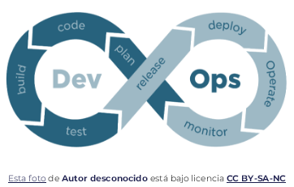

Partiendo de un enfoque ágil para el desarrollo de software, el proceso de DevOps amplía esta base mediante la integración de las operaciones y el desarrollo en un marco interdisciplinario. Este enfoque permite la creación y entrega de aplicaciones de manera más rápida e iterativa.

*“Al adoptar un proceso de desarrollo de DevOps, está tomando la decisión de mejorar el flujo y la entrega de valor de su aplicación fomentando un entorno más colaborativo en todas las etapas del ciclo de desarrollo”,* (GitLab, GitLab, s.f.). 

DevOps representa un cambio paradigmático en la cultura de las tecnologías de la información. Se fundamenta en prácticas ágiles, en la filosofía Lean y en la teoría de sistemas, enfocándose en el desarrollo incremental y en la rápida entrega de software.

El éxito de esta transformación depende de la capacidad para fomentar una cultura de responsabilidad, colaboración mejorada, empatía y un compromiso compartido con los resultados.
## Metodología de DevOps
La metodología DevOps tiene como objetivo principal reducir la duración del ciclo de vida del desarrollo de sistemas y facilitar una entrega continua de software de alta calidad. Esta metodología pone un fuerte énfasis en la colaboración, la automatización, la integración y la implementación de ciclos de retroalimentación ágiles. Estas características son esenciales para asegurar una cultura de creación, prueba y lanzamiento de software que sea confiable y eficiente.

DevOps se fundamenta en cuatro principios clave que guían la efectividad y eficiencia en el desarrollo y la implementación de aplicaciones. A continuación, se presentan estos principios, que se centran en los aspectos más destacados del desarrollo de software contemporáneo.
### Principios fundamentales de DevOps
1. **Automatización del ciclo de desarrollo del software:** este principio abarca la automatización de pruebas, compilaciones, lanzamientos, provisión de entornos de desarrollo y otras tareas manuales que pueden ralentizar el proceso de entrega de software o introducir errores humanos.
1. **Colaboración y comunicación:** un equipo de DevOps eficiente combina la automatización con una colaboración y una comunicación efectivas, lo que permite alcanzar un rendimiento óptimo.
1. **Mejora continua y minimización de desperdicios:** desde la auto-automatización de tareas repetitivas hasta la monitorización de métricas de rendimiento, los equipos de DevOps de alto rendimiento realizan revisiones periódicas para identificar áreas susceptibles de mejora, con el propósito de reducir los tiempos de lanzamiento y el tiempo medio de recuperación.
1. **Hiperenfoque en las necesidades del usuario mediante ciclos de retroalimentación breves:**  a través de la automatización, la mejora en la comunicación y colaboración, así como la mejora continua, los equipos de DevOps tienen la oportunidad de centrarse en las verdaderas necesidades de los usuarios y en la manera de satisfacerlas de forma efectiva.

*“Al adoptar estos principios, las organizaciones pueden mejorar la calidad del código, lograr un tiempo de comercialización más rápido y participar en una mejor planificación de las aplicaciones”* (GitLab, GitLab, s.f.).
## ¿Qué es una tubería o pipeline CI/CD?
Una tubería CI/CD coordina todos los procesos involucrados en la integración y la entrega continuas.

**Integración continua (CI)** es un proceso en el que los desarrolladores integran código continuamente en pequeños incrementos a veces varias veces al día, que luego se construye y prueba automáticamente antes de fusionarse con el repositorio compartido.

El objetivo principal de CI es proporcionar retroalimentación rápida para que, si se introduce un defecto en la base de código, se pueda identificar y corregir lo antes posible. CI ayuda a reducir el tiempo y el esfuerzo necesarios para los problemas de integración y permite a los desarrolladores mejorar la calidad del software continuamente.

**Entrega continua (CD)** extiende CI implementando automáticamente todos los cambios de código en un entorno de QA y/o producción después de la etapa de compilación. Esto garantiza que pueda lanzar nuevos cambios a sus clientes de manera rápida y sostenible. Esta práctica ayuda a los desarrolladores a automatizar el proceso de implementación, minimizar los errores en la producción y aumentar la velocidad de las versiones de software.

El CI la parte de una tubería CI/CD incluye las etapas de código fuente, compilación y prueba del ciclo de vida de entrega del software, mientras que la parte de CD incluye las etapas de entrega e implementación.
# DORA Core Model
Como parte de las buenas prácticas en la metodología DevOps, tenemos como marco de referencia DORA.

*“DORA Core es una colección de capacidades, métricas y resultados que representan los hallazgos más firmemente establecidos de toda la historia y la amplitud del programa de investigación de DORA”* (DORA, 2024) . Como marco de referencia para la excelencia técnica en DevOps, proporciona una base científica para medir y mejorar el rendimiento de entrega de software. Este modelo, desarrollado por el equipo de Google Cloud's DevOps Research and Assessment (DORA), se basa en años de investigación rigurosa sobre prácticas de alto rendimiento en la industria del software.

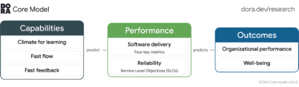

El modelo DORA Core se estructura en tres componentes principales:

1. **Capacidades técnicas:** Las capacidades representan las prácticas técnicas y culturales que los equipos implementan:
   1. Clima para el aprendizaje: entorno que fomenta la experimentación y el aprendizaje continuo.
   1. Flujo rápido: procesos que permiten mover cambios rápidamente del desarrollo a la producción.
   1. Retroalimentación rápida: sistemas que proporcionan información inmediata sobre la calidad y el impacto de los cambios.
1. **Métricas clave de rendimiento:** cuatro indicadores fundamentales que miden la efectividad de los equipos de desarrollo:
   1. Frecuencia de despliegue: con qué frecuencia la organización despliega código en producción.
   1. Tiempo de entrega de cambios: tiempo que transcurre desde el commit hasta el despliegue en producción.
   1. Tiempo medio de recuperación (MTTR): rapidez con la que un servicio se recupera de fallos.
   1. Tasa de fallos de cambios: porcentaje de cambios que resultan en degradación del servicio.
1. **Resultados organizacionales:** beneficios empresariales derivados de mejorar las capacidades y métricas, incluyendo mejor estabilidad operacional, mayor agilidad, y reducción de burnout en los equipos:
   1. Rendimiento organizacional: mejoras en la eficiencia operativa y los resultados de negocio. 
   1. Bienestar: reducción del burnout y aumento de la satisfacción de los equipos.

La implementación del modelo DORA permite a las organizaciones medir objetivamente su posición actual, establecer objetivos de mejora basados en datos, y crear hojas de ruta para avanzar hacia niveles más altos de rendimiento en DevOps.
# Herramientas en GCP
La implementación efectiva de DevOps en Google Cloud Platform requiere una cuidadosa selección y configuración de herramientas que se alineen con los objetivos y arquitectura de cada organización. GCP ofrece un ecosistema completo de servicios diseñados específicamente para soportar prácticas modernas de DevOps, permitiendo la automatización, escalabilidad y seguridad necesarias en entornos cloud-native.

A continuación, se presentan las principales herramientas y recomendaciones organizadas por áreas funcionales del ciclo DevOps:
## 1. Configuración del entorno
### Gestión de proyectos en GCP
- Establecer una estructura jerárquica de organización, carpetas y proyectos.
- Implementar políticas de IAM (Identity and Access Management) a nivel de organización.
- Separar entornos: desarrollo, pruebas, preproducción y producción.
### Configuración de credenciales
- Utilizar cuentas de servicio con privilegios mínimos.
- Configurar la rotación automática de claves.
- Implementar Cloud KMS para gestionar secretos.
### Redes y conectividad
- Configurar VPC (Virtual Private Cloud) con subredes para diferentes entornos.
- Establecer reglas de firewall restrictivas.
- Configurar Cloud NAT para acceso saliente de instancias privadas.
## 2. Control de versiones
### Gestión del código fuente
- Utilizar GitHub/GitLab integrado con GCP.
- Implementar estrategia de ramificación (por ejemplo, GitFlow o Trunk-Based Development).
- Establecer políticas de protección de ramas.
### Gestión de Configuraciones
- Separar código de configuración.
- Utilizar Config Management para gestionar configuraciones.
- Implementar estrategias para secretos con Secret Manager.
### Versionado de artefactos
- Utilizar Artifact Registry para almacenar imágenes de contenedores, paquetes y artefactos.
- Implementar etiquetas semánticas de versiones.
- Configurar políticas de retención de artefactos.
## 3. Integración Continua (CI)
### Automatización de construcciones
- Configurar Cloud Build o Jenkins para la construcción automatizada.
- Definir triggers para iniciar builds automáticamente con cada commit.
- Implementar matriz de construcción para diferentes entornos.
### Pruebas automatizadas
- Configurar pruebas unitarias, de integración y extremo a extremo.
- Implementar pruebas de seguridad y análisis estático de código.
- Utilizar servicios de pruebas en la nube como Firebase Test Lab.
### Validación de calidad
- Integrar SonarQube o Code Quality con Cloud Build.
- Establecer umbrales de cobertura de código.
- Implementar revisiones de código automatizadas.
## 4. Entrega Continua (CD)
### Estrategias de despliegue
- Implementar despliegues Blue/Green para minimizar tiempo de inactividad.
- Utilizar despliegues Canary para probar con un subconjunto de usuarios.
- Configurar rollbacks automatizados en caso de fallo.
### Orquestación de despliegues
- Utilizar Cloud Deploy para gestionar pipelines de entrega.
- Configurar aprobaciones manuales para entornos críticos.
- Implementar hooks pre y post despliegue.
### Gestión de configuraciones
- Configurar Runtime Config API para configuraciones dinámicas.
- Implementar Feature Flags con Apigee o Firebase Remote Config.
- Utilizar Config Connector para recursos de GCP.
## 5. Infraestructura como Código (IaC)
### Herramientas de IaC
- Utilizar Terraform o Deployment Manager para definir infraestructura.
- Implementar módulos reutilizables.
- Gestionar estado de Terraform en Google Cloud Storage.
### Automatización de infraestructura
- Configurar pipelines de CI/CD para cambios en infraestructura.
- Implementar validación de configuraciones con política como código.
- Utilizar plan de ejecución y aprobación para cambios críticos.
### Gestión de configuración
- Implementar Config Management para la configuración de aplicaciones.
- Utilizar Anthos Config Management para configuraciones entre múltiples clusters.
- Aplicar principios GitOps para la gestión de configuraciones.
## 6. Monitoreo y observabilidad
### Monitoreo de aplicaciones
- Configurar Cloud Monitoring para métricas de aplicaciones y sistemas.
- Implementar Cloud Trace para seguimiento distribuido.
- Configurar Cloud Profiler para análisis de rendimiento.
### Gestión de logs
- Centralizar logs con Cloud Logging.
- Configurar exportaciones de logs a BigQuery para análisis a largo plazo.
- Implementar alertas basadas en patrones de logs.
### Alertas y respuesta a incidentes
- Configurar políticas de alertas en Cloud Monitoring.
- Integrar con sistemas de gestión de incidentes como PagerDuty.
- Establecer procedimientos de respuesta a incidentes y escalación.
## 7. Seguridad
### Seguridad de red
- Implementar Cloud Armor para protección contra DDoS y WAF.
- Configurar VPC Service Controls para aislar recursos.
- Utilizar Cloud IDS para detección de intrusiones.
### Gestión de identidades
- Implementar IAM con principio de mínimo privilegio.
- Configurar federación de identidades con proveedores externos.
- Utilizar Identity-Aware Proxy para acceso seguro a aplicaciones.
### Seguridad continua
- Configurar Security Command Center para visibilidad centralizada.
- Implementar escaneo de vulnerabilidades con Container Security.
- Utilizar Binary Authorization para verificar la integridad de imágenes.
## 8. Gestión de costos
### Visibilidad de costos
- Configurar presupuestos y alertas en Cloud Billing.
- Implementar etiquetas para categorizar recursos y costos.
- Utilizar Recommender para optimización de costos.
### Optimización de recursos
- Implementar auto-scaling para ajustar recursos según demanda.
- Utilizar instancias preemptibles para cargas de trabajo tolerantes a fallos.
- Configurar políticas de ciclo de vida para almacenamiento y retención de datos.
### Presupuestos y alertas
- Configurar presupuestos por proyecto y equipo.
- Implementar alertas de umbral de gastos.
- Utilizar exportación de facturación a BigQuery para análisis detallado.
## 9. Prácticas recomendadas
### Colaboración en equipo
- Implementar entornos de desarrollo estandarizados con Cloud Workstations.
- Utilizar Cloud Code para desarrollo integrado.
- Configurar políticas de colaboración y permisos por equipo.
### Documentación
- Mantener documentación como código junto al repositorio.
- Implementar documentación automatizada de APIs con endpoints.
- Mantener runbooks para operaciones comunes y resolución de problemas.
### Gestión del conocimiento
- Implementar wikis técnicos para conocimientos compartidos.
- Configurar repositorios de arquitectura de referencia.
- Documentar patrones y anti-patrones específicos de GCP.
## 10. Herramientas y servicios de GCP
### Servicios de computación
- Cloud Run para servicios sin estado y basados en contenedores.
- Google Kubernetes Engine (GKE) para orquestación de contenedores.
- Compute Engine para VM personalizadas.
- App Engine para aplicaciones sin servidor.
### Servicios de almacenamiento
- Cloud Storage para objetos y archivos estáticos.
- Cloud SQL para bases de datos relacionales.
- Firestore y Datastore para bases de datos NoSQL.
- Memorystore para caché en memoria.
### Servicios de redes
- Cloud CDN para distribución de contenido.
- Cloud Load Balancing para distribución de tráfico.
- Cloud DNS para gestión de dominios.
- Cloud Interconnect para conectividad híbrida.
### Herramientas de DevOps
- Cloud Build para CI/CD.
- Cloud Deploy para gestión de despliegue.
- Artifact Registry para gestión de artefactos.
# Implementación
Ahora que hemos explorado los fundamentos teóricos de DevOps, las mejores prácticas en su desarrollo y las diversas herramientas que ofrece Google Cloud Platform, es momento de pasar a la implementación práctica.
## Despliegue automatizado con Vue.js 3, GitHub y GCP
En esta sección, vamos a desarrollar paso a paso un ejemplo completo que demuestra cómo implementar una metodología DevOps eficiente. Utilizaremos:

- Una aplicación frontend desarrollada en Vue.js 3.
- GitHub como sistema de control de versiones.
- Servicios de Google Cloud Platform orientados a DevOps para automatizar el despliegue.

>***Nota importante:** antes de comenzar, asegúrate de crear una cuenta de servicio en tu proyecto de GCP con los permisos mínimos necesarios para administrar los recursos que utilizaremos.*
### Preparación la aplicación y dockerización
1. Descargar el siguiente proyecto [**Archivos.zip**](https://drive.google.com/file/d/1FbsgCc_haIZZVzgmlPq9X0uNMS8ZBgGq/view?usp=sharing), al descomprimir el `.zip` se encontrará dentro los archivos de un proyecto de prueba de Vue.js 3, llamado ***“devops-test”.***
1. ​Crear un repositorio en GitHub y subir a ese repositorio la app descargada.
1. Crear un archivo en la raíz de nuestro proyecto llamado **`Dockerfile`**. 
1. Agregar el siguiente código, que creará una imagen de nuestra aplicación y creará un servidor web con Nginx, con un archivo de configuración en la raíz de nuestro proyecto que lo expone en el puerto `8080`:
   ```Dockerfile
   FROM node:18 AS build

   WORKDIR /app

   COPY package.json  ./

   RUN npm install

   COPY . .

   RUN npm run build

   FROM nginx:stable-alpine

   COPY --from=build /app/dist /usr/share/nginx/html

   COPY nginx.conf /etc/nginx/nginx.conf

   EXPOSE 8080

   CMD ["nginx", "-g", "daemon off;"]
   ```
5. En Cloud Shell o desde el SDK de Google crear un repositorio para almacenar las imágenes Docker en GCP:
   ```bash
   gcloud artifacts repositories create devops-repository \
         --repository-format=docker \
         --location=us-central1 \
         --description="Repositorio de pruebas Devops"
   ```
6. Creamos la imagen localmente:
   ```bash
   docker build -t app-devops-image .
   ```
7. Ahora llevamos nuestra imagen hacia el repositorio en GCP:
   ```bash
   docker tag app-devops-image us-central1-docker.pkg.dev/$GOOGLE\_CLOUD\_PROJECT/devops-repository/app-devops-image


   docker push us-central1-docker.pkg.dev/$GOOGLE\_CLOUD\_PROJECT/devops-repository/app-devops-image
```
### Desplegando imagen
Tenemos la imagen de nuestra aplicación lista. Ahora vamos a levantarla en una instancia de Cloud Run:
```bash
gcloud run deploy devops-app \
      --image us-central1-docker.pkg.dev/$GOOGLE\_CLOUD\_PROJECT/devops-repository/app-devops-image \
      --region us-central1 \
      --platform managed \
      --allow-unauthenticated
```
### Despliegue automático
Crearemos 2 ambientes, uno de pruebas y uno de producción, con Cloud Build haremos que detecte los cambios de sus respectivas ramas para hacer un despliegue con los cambios en los diferentes ambientes:

1. Crear archivo en la raiz del proyecto llamado `cloudbuild-staging.yaml`.
1. Y pegar el siguiente código. `Ctrl + O` para guardar y `Ctrl + X` para salir:
   ```yaml
   steps:
   - name: 'gcr.io/cloud-builders/docker'
      args: [
         'build',
         '-t',
         'us-central1-docker.pkg.dev/$PROJECT_ID/devops-repository/app-devops-image:$COMMIT_SHA',
         '.'
      ]
   - name: 'gcr.io/cloud-builders/docker'
      args: [
         'push',
         'us-central1-docker.pkg.dev/$PROJECT_ID/devops-repository/app-devops-image:$COMMIT_SHA'
      ]
   - name: 'gcr.io/cloud-builders/gcloud'
      entrypoint: 'gcloud'
      args: [
         'run',
         'deploy',
         'devops-app-staging',
         '--image',
         'us-central1-docker.pkg.dev/$PROJECT_ID/devops-repository/app-devops-image:$COMMIT_SHA',
         '--region',
         'us-central1',
         '--platform',
         'managed',
         '--allow-unauthenticated'
      ]
   images:
   - 'us-central1-docker.pkg.dev/$PROJECT_ID/devops-repository/app-devops-image:$COMMIT_SHA'
   options:
   logging: CLOUD_LOGGING_ONLY
   ```
3. Crear un segundo archivo en la raíz del proyecto llamado `cloudbuild-production.yaml`: 
   ```yaml
   steps:
   - name: 'gcr.io/cloud-builders/docker'
      args: [
         'build',
         '-t',
         'us-central1-docker.pkg.dev/$PROJECT_ID/devops-repository/app-devops-image:$COMMIT_SHA',
         '.'
      ]
   - name: 'gcr.io/cloud-builders/docker'
      args: [
         'push',
         'us-central1-docker.pkg.dev/$PROJECT_ID/devops-repository/app-devops-image:$COMMIT_SHA'
      ]
   - name: 'gcr.io/cloud-builders/gcloud'
      entrypoint: 'gcloud'
      args: [
         'run',
         'deploy',
         'devops-app-production',
         '--image',
         'us-central1-docker.pkg.dev/$PROJECT_ID/devops-repository/app-devops-image:$COMMIT_SHA',
         '--region',
         'us-central1',
         '--platform',
         'managed',
         '--allow-unauthenticated'
      ]
   images:
   - 'us-central1-docker.pkg.dev/$PROJECT_ID/devops-repository/app-devops-image:$COMMIT_SHA'
   options:
   logging: CLOUD_LOGGING_ONLY
   ```
4. Nos dirigimos hacia Cloud Build (habilitamos la API de ser necesario).
1. En repositorios conectamos un nuevo repositorio (global, github, continuar, seleccionamos cuenta y el repositorio, aceptamos y creamos).
1. Pasamos a crear el trigger:
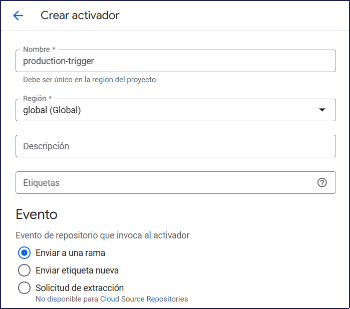
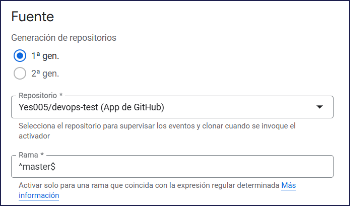
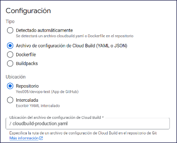
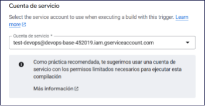
1. Seleccionamos la cuenta de servicio creada previamente y le damos crear.
1. Creamos una rama a partir de master con el nombre staging:
   ```bash
   git checkout -b staging
   ```
9. Creamos un segundo trigger con el nombre staging-trigger indicándole que use el archivo cloudbuild-staging.yaml y detecte los cambios de la rama staging.
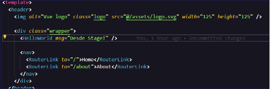
Buscamos el archivo App.vue y modificamos el mensaje del componente `HelloWorld`:
1. Incluímos los cambios a la rama staging:
   ```bash
   git add .

   git commit -m "Realizando cambios desde staging"

   git push origin staging
   ```
1. Nos crea la nueva instancia en Cloud Run para staging:
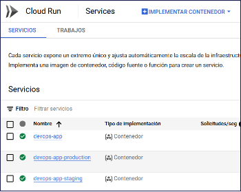
1. Entramos a la URL que nos genera y veremos nuestra app ya funcionando:
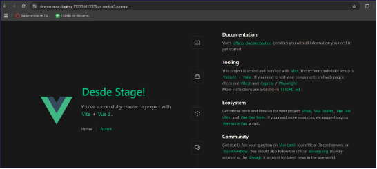


## Configuración e Implementación de GitLab Runner con Terraform en Google Cloud
### Visión general
Esta guía proporciona instrucciones detalladas para configurar e implementar GitLab Runner en su repositorio, habilitando la ejecución automatizada de pipelines CI/CD. Aprenderá a crear un runner utilizando Terraform en Google Cloud, registrarlo con su proyecto de GitLab, y ejecutar su primera pipeline. La implementación se realizará en un entorno real en la nube utilizando una máquina virtual dedicada para ejecutar sus tareas de CI/CD, permitiéndole automatizar pruebas, despliegues y otras operaciones definidas en su archivo .gitlab-ci.yml. 

Los pipelines son capaces de ejecutarse en entornos de:

- Shell.
- Docker.
- Kubernetes.

El propósito de esta guía es lanzar su primer pipeline haciendo uso una máquina virtual la cual se encargará de ejecutar las tareas de su repositorio.
### Configuración y requerimientos
#### *Antes de empezar la guía*
Esta actividad se realizará en un entorno en la nube real, no es una simulación o demo, por lo que, recuerda detener los servicios al finalizar las pruebas para evitar sorpresas de facturación.
#### *Activar Cloud Shell*
Cloud Shell es una máquina virtual configurada con herramientas de desarrollo, para esta práctica se utiliza la herramienta Terraform, esta herramienta permite administrar los recursos de Google Cloud.
### Requisitos previos
#### *Clonar el repositorio*
1. Accede al siguiente enlace: [GitLab Runner en GitLab eGob](https://gitlab.egob.sv/gcp/gitlab-runner).
1. Realiza un fork del repositorio para crear tu propia versión.
1. Una vez creado el fork, copia la URL de tu repositorio.
1. En tu terminal, clona tu versión del fork con el siguiente comando:
   ```bash
   git clone https://gitlab.egob.sv/tuusuario/gitlab-runner.git

   cd gitlab-runner
   ```
#### *Configurar el runner en tu proyecto*
>***Nota importante:** debes tener el rol de **Maintainer** en el proyecto.*

Al crear un runner, se le asigna un **token de autenticación** que se usa para registrarlo. Este token permite que el runner se autentique con GitLab y pueda ejecutar trabajos desde la cola de trabajos.
##### Pasos para crear un runner de proyecto
1. En la barra lateral izquierda, selecciona **Buscar** o accede a tu proyecto.
1. Ve a **Configuración > CI/CD**.
1. Expandir la sección **Runners**.
1. Selecciona **Nuevo runner de proyecto**.
1. Elige el sistema operativo donde se instalará GitLab Runner (Linux).
1. Marcar la casilla **Ejecutar sin etiquetas**.
1. (Opcional) En el campo **Descripción del runner**, agrega una descripción que se mostrará en GitLab.
1. (Opcional) En la sección **Configuración**, agrega configuraciones adicionales.
1. Selecciona **Crear runner**.
1. Se notificará la creación del token de autenticación, obtendrá un token con el formato **`glrt-`**.
1. Almacenar este token ya que será utilizado para el registro del runner.
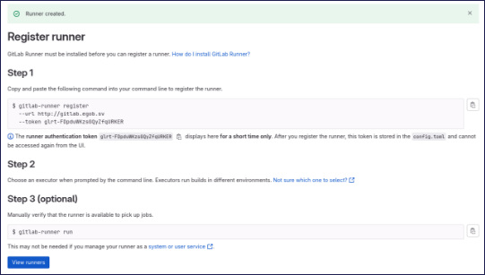

### Terraform y Google Cloud Shell
#### *¿Qué es Terraform?*
Terraform es una herramienta de Infraestructura como Código (IaC) que permite crear, administrar y automatizar recursos en la nube mediante archivos de configuración. Facilita la implementación de infraestructura de manera reproducible y escalable en plataformas como Google Cloud, AWS y Azure. Continuamos con los pasos a seguir para utilizar Terraform:

1. Abrir Google Cloud Shell.
   1. Accede a la consola de Google Cloud: https://console.cloud.google.com/.
   1. En la parte superior derecha, haz clic en el icono de **Cloud Shell** para abrir la terminal.
1. Subir el archivo `terraform.tf`. 
   1. En Cloud Shell, haz clic en el icono de Subir archivo.
   1. Selecciona el archivo `terraform.tf` desde tu computadora y súbelo a Cloud Shell.
1. Inicializar Terraform. 
   1. En la terminal de Cloud Shell, ejecuta el siguiente comando para inicializar Terraform:
      ```bash
      terraform init
      ```
1. Aplicar la configuración de Terraform. 
   1. Ejecuta el siguiente comando para comenzar la implementación:
      ```bash
      terraform apply
      ```
   1. Terraform solicitará ingresar el **token de autenticación** del runner. Ingrésalo y presiona **Enter**.
   1. Luego, se mostrará un resumen de los recursos que se crearán. Escribe **yes** y presiona **Enter** para confirmar.
1. Esperar la creación del runner.
   1. La ejecución tomará aproximadamente 5 minutos, ya que Terraform desplegará una instancia en Google Cloud con Docker y configurará la regla de salida necesaria para permitir la conexión con GitLab eGob.
   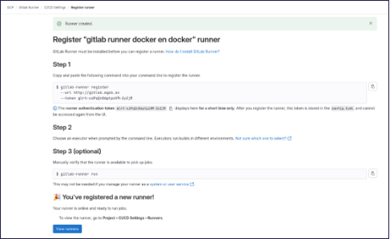

### Ejecutar la pipeline en GitLab
1. Crear un nuevo archivo en el repositorio.
   1. En la terminal, navega al directorio de tu repositorio:
      ```bash
      cd gitlab-runner
      ```
   1. Crea un nuevo archivo, por ejemplo, **test.txt** 
      ```bash
      echo "Prueba de ejecución del pipeline" > test.txt
      ```
1. Agregar y confirmar los cambios.
   1. Agrega el archivo al control de versiones:
      ```bash
      git add test.txt
      ```
   1. Crea un nuevo archivo, por ejemplo, `test.txt` 
      ```bash
      git commit -m "Agregando archivo de prueba para ejecutar pipeline"
      ```
1. Hacer push a la rama main.
   1. Sube los cambios al repositorio remoto:
      ```bash
      git push origin main
      ```
1. Esperar la ejecución del pipeline.
   1. Una vez que el push se haya completado, GitLab ejecutará el pipeline automáticamente. 
   1. Ve a **GitLab > CI/CD > Pipelines** para ver el progreso.
   
1. Revisar la ejecución del `docker run hello-world`.
   1. El pipeline ejecutará el siguiente comando dentro del runner:
   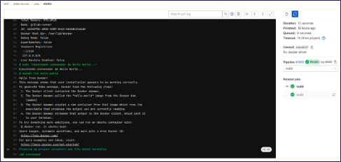
1. Modificar `.gitlab-ci.yml` para personalizar los flujos.
   1. Ahora puedes editar el archivo `.gitlab-ci.yml` en el repositorio para definir nuevos flujos de CI/CD según tus necesidades.

# Referencias bibliográficas
DORA. (2024). *DORA*. Obtenido de dora.dev: https://dora.dev/research/2024

GitLab. (s.f.). *GitLab*. Obtenido de learn.gitlab.com: https://learn.gitlab.com/beginners-guide-devops/guide-to-devops

GitLab. (s.f.). *GitLab*. Obtenido de about.gitlab.com: https://about.gitlab.com/es/topics/devops

Google. (s.f.). *Google Cloud*. Obtenido de cloud.google.com: https://cloud.google.com/devops

