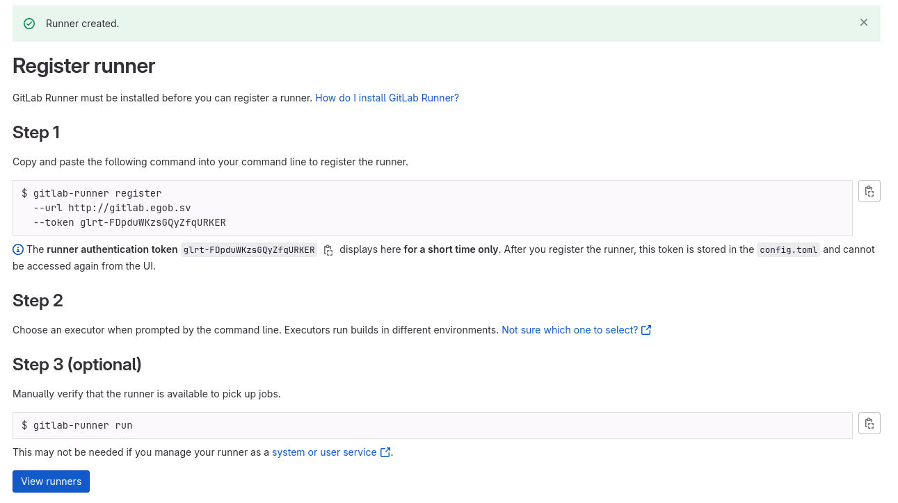
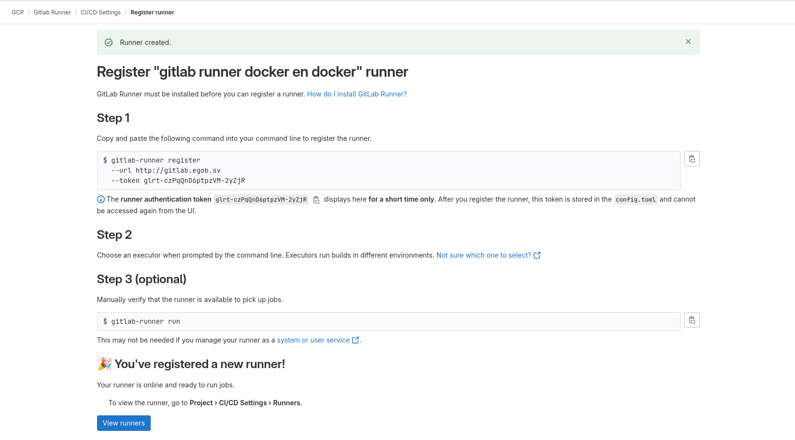
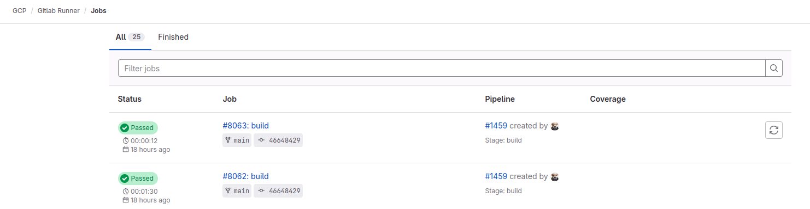
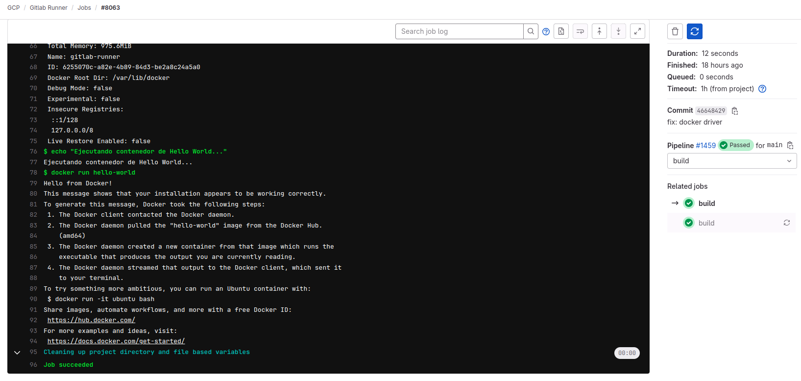

# [Manual] Configuración e Implementación de GitLab Runner con Terraform en Google Cloud
## Visión general
Esta guía proporciona instrucciones detalladas para configurar e implementar GitLab Runner en su repositorio, habilitando la ejecución automatizada de pipelines CI/CD. Aprenderá a crear un runner utilizando Terraform en Google Cloud, registrarlo con su proyecto de GitLab, y ejecutar su primera pipeline. La implementación se realizará en un entorno real en la nube utilizando una máquina virtual dedicada para ejecutar sus tareas de CI/CD, permitiéndole automatizar pruebas, despliegues y otras operaciones definidas en su archivo .gitlab-ci.yml. 

Los pipelines son capaces de ejecutarse en entornos de:

- Shell.
- Docker.
- Kubernetes.

El propósito de esta guía es lanzar su primer pipeline haciendo uso una máquina virtual la cual se encargará de ejecutar las tareas de su repositorio.
## Configuración y requerimientos
### *Antes de empezar la guía*
Esta actividad se realizará en un entorno en la nube real, no es una simulación o demo, por lo que, recuerda detener los servicios al finalizar las pruebas para evitar sorpresas de facturación.
##### *Activar Cloud Shell*
Cloud Shell es una máquina virtual configurada con herramientas de desarrollo, para esta práctica se utiliza la herramienta Terraform, esta herramienta permite administrar los recursos de Google Cloud.
## Requisitos previos
### *Clonar el repositorio*
1. Accede al siguiente enlace: [GitLab Runner en GitLab eGob](https://gitlab.egob.sv/gcp/gitlab-runner).
1. Realiza un fork del repositorio para crear tu propia versión.
1. Una vez creado el fork, copia la URL de tu repositorio.
1. En tu terminal, clona tu versión del fork con el siguiente comando:
   ```bash
   git clone https://gitlab.egob.sv/tuusuario/gitlab-runner.git

   cd gitlab-runner
   ```
### *Configurar el runner en tu proyecto*
>***Nota importante:** debes tener el rol de **Maintainer** en el proyecto.*

Al crear un runner, se le asigna un **token de autenticación** que se usa para registrarlo. Este token permite que el runner se autentique con GitLab y pueda ejecutar trabajos desde la cola de trabajos.
#### Pasos para crear un runner de proyecto
1. En la barra lateral izquierda, selecciona **Buscar** o accede a tu proyecto.
1. Ve a **Configuración > CI/CD**.
1. Expandir la sección **Runners**.
1. Selecciona **Nuevo runner de proyecto**.
1. Elige el sistema operativo donde se instalará GitLab Runner (Linux).
1. Marcar la casilla **Ejecutar sin etiquetas**.
1. (Opcional) En el campo **Descripción del runner**, agrega una descripción que se mostrará en GitLab.
1. (Opcional) En la sección **Configuración**, agrega configuraciones adicionales.
1. Selecciona **Crear runner**.
1. Se notificará la creación del token de autenticación, obtendrá un token con el formato **`glrt-`**.
1. Almacenar este token ya que será utilizado para el registro del runner.

   

## Terraform y Google Cloud Shell
### *¿Qué es Terraform?*
Terraform es una herramienta de Infraestructura como Código (IaC) que permite crear, administrar y automatizar recursos en la nube mediante archivos de configuración. Facilita la implementación de infraestructura de manera reproducible y escalable en plataformas como Google Cloud, AWS y Azure. Continuamos con los pasos a seguir para utilizar Terraform:

1. Abrir Google Cloud Shell.
   1. Accede a la consola de Google Cloud: https://console.cloud.google.com/.
   1. En la parte superior derecha, haz clic en el icono de **Cloud Shell** para abrir la terminal.
1. Subir el archivo `terraform.tf`. 
   1. En Cloud Shell, haz clic en el icono de Subir archivo.
   1. Selecciona el archivo `terraform.tf` desde tu computadora y súbelo a Cloud Shell.
1. Inicializar Terraform. 
   1. En la terminal de Cloud Shell, ejecuta el siguiente comando para inicializar Terraform:
      ```bash
      terraform init
      ```
1. Aplicar la configuración de Terraform. 
   1. Ejecuta el siguiente comando para comenzar la implementación:
      ```bash
      terraform apply
      ```
   1. Terraform solicitará ingresar el **token de autenticación** del runner. Ingrésalo y presiona **Enter**.
   1. Luego, se mostrará un resumen de los recursos que se crearán. Escribe **yes** y presiona **Enter** para confirmar.
1. Esperar la creación del runner.
   1. La ejecución tomará aproximadamente 5 minutos, ya que Terraform desplegará una instancia en Google Cloud con Docker y configurará la regla de salida necesaria para permitir la conexión con GitLab eGob.

      

#### Ejecutar la pipeline en GitLab
1. Crear un nuevo archivo en el repositorio.
   1. En la terminal, navega al directorio de tu repositorio:
      ```bash
      cd gitlab-runner
      ```
   1. Crea un nuevo archivo, por ejemplo, **test.txt** 
      ```bash
      echo "Prueba de ejecución del pipeline" > test.txt
      ```
1. Agregar y confirmar los cambios.
   1. Agrega el archivo al control de versiones:
      ```bash
      git add test.txt
      ```
   1. Crea un nuevo archivo, por ejemplo, `test.txt` 
      ```bash
      git commit -m "Agregando archivo de prueba para ejecutar pipeline"
      ```
1. Hacer push a la rama main.
   1. Sube los cambios al repositorio remoto:
      ```bash
      git push origin main
      ```
1. Esperar la ejecución del pipeline.
   1. Una vez que el push se haya completado, GitLab ejecutará el pipeline automáticamente. 
   1. Ve a **GitLab > CI/CD > Pipelines** para ver el progreso.
   
      

1. Revisar la ejecución del `docker run hello-world`.
   1. El pipeline ejecutará el siguiente comando dentro del runner:
   
      

1. Modificar `.gitlab-ci.yml` para personalizar los flujos.
   1. Ahora puedes editar el archivo `.gitlab-ci.yml` en el repositorio para definir nuevos flujos de CI/CD según tus necesidades.