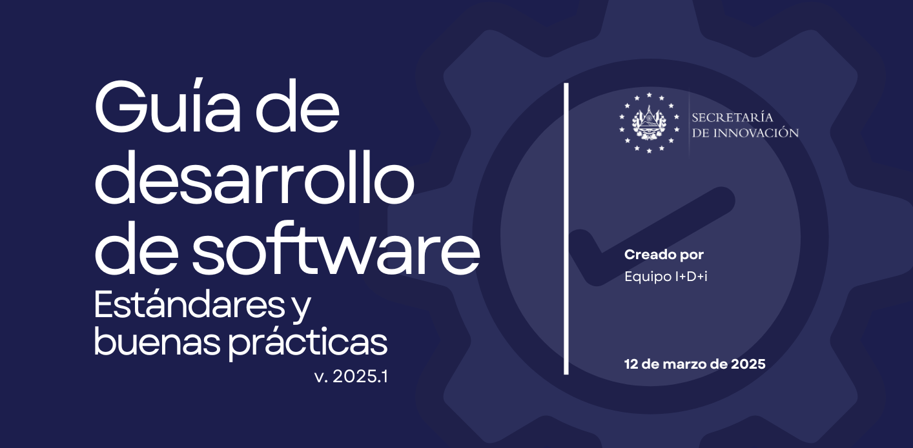

# [Guía] Desarrollo de software

:::info
Guía enfocada a los estándares y buenas prácticas en el desarrollo de software.
:::

:::tip
## Descargar la guía en formato PDF
[🔗Descargar guía de desarrollo de software](../../../static/docs/Guía%20de%20desarrollo%20de%20software%20-%20SIP.pdf)
:::

## Introducción
En el ámbito del desarrollo de software, la estandarización y las buenas prácticas constituyen pilares fundamentales para garantizar la calidad, mantenibilidad y escalabilidad de las aplicaciones. El presente documento establece los estándares y lineamientos oficiales que deberán implementar y seguir todos los equipos de desarrollo de la Secretaría de Innovación de la Presidencia.

La ausencia de estándares unificados en los procesos de desarrollo ha generado una serie de problemáticas significativas:

- Código de difícil mantenimiento y comprensión.
- Duplicación sistemática de funcionalidades entre proyectos.
- Incidencia elevada de errores en entornos productivos.
- Documentación técnica insuficiente o inexistente.
- Redundancia de código y soluciones.
- Dificultades para la transferencia de conocimiento.

Estas dificultades no solo afectan la calidad del producto final entregado a las instituciones y/o ciudadanos, sino que también impactan negativamente en la eficiencia operativa de los equipos, generando costos adicionales y retrasos en la implementación de nuevas funcionalidades prioritarias para la administración pública.

La implementación de los estándares contenidos en este documento busca mejorar significativamente la productividad de los equipos, reducir la incidencia de errores en producción y facilitar la colaboración efectiva entre desarrolladores, independientemente del proyecto en el que se desempeñen. Los beneficios esperados incluyen:

1. Optimización de recursos técnicos y humanos.
1. Reducción de tiempos de desarrollo y mantenimiento.
1. Mejora en la calidad general del software producido.
1. Facilitación de la incorporación de nuevos profesionales a los equipos.
1. Establecimiento de métricas objetivas de calidad.

Se reconoce que, hasta el presente, cada equipo ha utilizado plantillas diferentes o ha iniciado proyectos desde cero según criterios individuales, sin una directriz institucional clara. En respuesta a esta situación, se han desarrollado estándares y plantillas unificadas para las diferentes tecnologías utilizadas en la Secretaría. Esta iniciativa tiene como objetivo estandarizar el desarrollo, garantizando coherencia metodológica y aplicación de buenas prácticas en todos los proyectos, independientemente del lenguaje o framework empleado.

Los lineamientos contenidos en este documento han sido elaborados considerando las mejores prácticas de la industria, adaptadas a las necesidades y contexto específicos de la administración pública, y su cumplimiento será objeto de evaluación periódica como parte de los indicadores de desempeño técnico de los equipos.

## Alcance
Establecer un conjunto de estándares y buenas prácticas para el desarrollo de software en la Secretaría de Innovación de la Presidencia, mediante la implementación de una plantilla desarrollada en Laravel que promueva la calidad, mantenibilidad y escalabilidad de las aplicaciones.

El presente documento se ha desarrollado contemplando el siguiente contenido:

1. La implementación de plantillas de desarrollo que incorporen estándares y buenas prácticas.
1. La estandarización de la estructura del código, facilitando la colaboración entre equipos.
1. La promoción de buenas prácticas, mejorando la calidad y mantenibilidad del software.
1. La implementación de pruebas automatizadas, reduciendo errores en producción.

## Estándares
Este documento establece las buenas prácticas que deben seguirse en la programación, seguridad, mantenimiento y calidad del código fuente, con el objetivo de garantizar su legibilidad, eficiencia y escalabilidad.

Estos estándares son de aplicación obligatoria para todos los desarrolladores y equipos de tecnología involucrados en la creación del software institucional, su cumplimiento es fundamental para facilitar la colaboración, reducir errores y mejorar la seguridad de las aplicaciones desarrolladas.

A continuación, se presentan los estándares que deben implementarse en el desarrollo de software:

- Deben utilizarse nombres descriptivos para clases, métodos, objetos u otros elementos.
- Las variables deben ser nombradas de acuerdo con su función en el código fuente.
- Todo el código fuente debe estar claramente tabulado o formateado.
- Deben realizarse pruebas unitarias en cada uno de los módulos, verificando que estos cumplan con los requerimientos del software.
- Los comentarios del código deben ser concisos y breves a menos que sean métodos complejos.
- Deben comentarse los distintos bloques de código, aplicando un criterio uniforme para cada nivel y siguiendo un modelo basado en los siguientes aspectos:
  - Incluir en cada clase una breve descripción, autor y fecha de última modificación.
  - Incluir por cada método, una descripción de su objeto y funcionalidades, así como de los parámetros y resultados obtenidos.
- Los comentarios en el código fuente deben mantenerse actualizados:
  - Si en algún momento la funcionalidad del código cambia, deben actualizarse los comentarios.
  - De cambiar la naturaleza de algún proceso, debe actualizarse inmediatamente el comentario asociado.
- Debe mantenerse el mismo estilo de formato y comentarios en el código fuente para permitir una mejor comprensión.
- No deben utilizarse palabras o frases indebidas en los nombres de entidades, métodos o comentarios dentro del código fuente.
- No deben almacenarse credenciales en el código fuente, se deben usar variables de entorno.
- Se debe aplicar validación y sanitización de entradas de usuario para evitar ataques.

## Buenas prácticas
Para garantizar un desarrollo eficiente, escalable y mantenible, es fundamental seguir una serie de buenas prácticas que optimicen el rendimiento, la seguridad y la calidad del código.

A continuación, se presentan algunas recomendaciones claves que deben aplicarse en el desarrollo de software, especialmente en el manejo de bases de datos y la optimización de consultas:

- Usar índices correctamente en las bases de datos relacionales y no relacionales para mejorar el rendimiento de las consultas SQL.
- Hacer uso de la sentencia JOIN cuando se requiera hacer consultas a múltiples tablas.
- Evitar el uso de subconsultas en tablas que contienen gran cantidad de información.
- Evitar seleccionar todos los campos de una tabla si no serán utilizados en su totalidad.
- Eliminar sentencias JOIN innecesarias.
- Valorar la desnormalización para mejorar el rendimiento, es decir, agregar identificadores en tablas, aunque no exista una relación formal entre ellas.
- Considerar el particionamiento de tablas que llegarán a contener volúmenes extremadamente grandes de datos.
- Al realizar una sentencia JOIN, comenzar por la tabla que contendrá mayor cantidad de datos.
- Utilizar la sentencia JOIN en lugar de WITH cuando se necesite filtrar y agregar condiciones con múltiples tablas, para evitar la generación de numerosas consultas y subconsultas.
- Evaluar el uso de procedimientos almacenados cuando se requieran procesos complejos de acceso a la base de datos.
- Implementar mecanismos de caché cuando sea necesario.
- Reutilizar código; si una función o método puede ser útil en varias partes del sistema, es una buena práctica extraerlo y colocarlo en un trait para evitar duplicidad de código.
- Añadir comentarios a los métodos que realizan operaciones complejas o que implementan lógica difícil de comprender a simple vista.
- Utilizar transacciones cuando se requiera realizar inserciones en múltiples tablas.
- Evitar la carga diferida (lazy loading) cuando no sea estrictamente necesaria.

## Plantillas de desarrollo
### Estándares para uso de plantilla en Laravel
[▶ Ir a la plantilla](/docs/GCP-Garden/Guía-DEV/Plantillas/plantilla-laravel)
